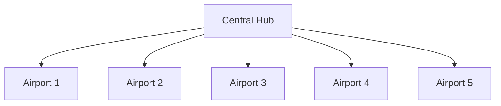
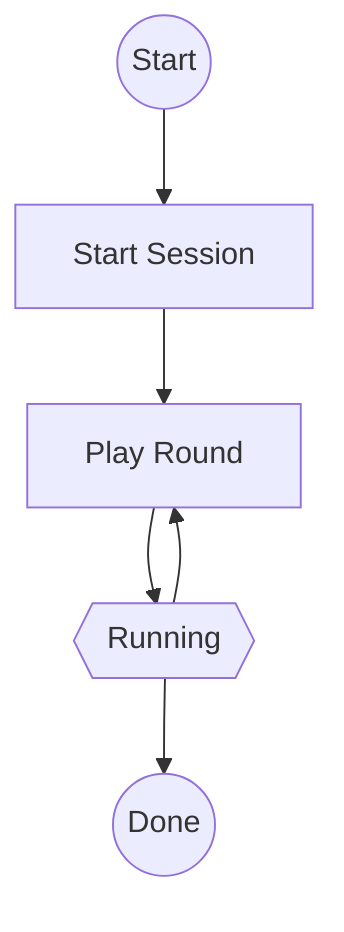

# Flight Rotables Optimization Platform

## Problem Statement

### Task

Optimize the management and delivery of rotables (passenger kit sets) across a network of airports and flights. The challenge is to minimize total cost while ensuring kits are available for passengers and outstation stocks are maintained, under strict operational and inventory constraints.

### Definitions


|Term|Definition	                                            |
---------|----------------------------------------------|
|Rotable|Re-usable item used for passengers on an airplane. It is expected that it can be processed at destination and reused for a subsequent flight. A rotable can be a cutlery set, set of dishes, pillow, blanket, headset.|
|Rotable Kit|A kit of rotables that is specific for a class. As a simplification, it is assumed that there is just one kit for each class and flight and the kits for a class are identical no matter the airplane, the length of the flight and the day hours of the flight|
|Hub and spoke|A way of designing a flight network of an airline where there is a single base airport (the hub) and a number of outstation airports. The flights are scheduled only between the hub and one outstation or between one outstation and the hub (return flight). This network model assumes that passengers will mostly have one layover at the hub|
|Hub|The main airport base of the airline, where all the critical operations, like maintenance, happens, where the airplanes are based.|
|Outstation|Airport in a hub and spoke setup where there is more limited support and where the airplanes are expected just to arrive and turnaround back to the hub|
|Turnaround|The set of operations that happens between the moment an airplane lands until it gets back again in the air (the return flight at an outstation). For this challenge, the turnarounds only happen at outstations. The operations which constitute a turnaround are usually debark passengers, unloading cargo and used items, cleanup, load meals, rotables, fuel, embark passengers|
|Flight class|The class of amenities on board. For this challenge, there are 4 expected classes: FIRST, BUSINESS, PREMIUM ECONOMY, ECONOMY. All the airplane types have all classes. Each class has exactly one designated rotable kit type.|


### Problem Description

Your team is tasked with developing an algorithm to efficiently manage the supply and logistics of rotables in the aviation network.

The data consists of:

1. **Airports** with limited storage capacities for rotables (kits), costs for loading rotable kits, costs and time for processing rotable kits. Airport data also includes the initial stocks of rotables.
2. **Flight schedule** which defines the connections between airports in the network (only HUB -> outstation and outstation->HUB). It also defines the hour of the flight and the frequency (indicating the days of the week when a flight is scheduled. The flight schedule doesn't include any information about the plane type, nor the expected number of passengers.
3. **Airplane types** which defines the types of airplanes that are operated by the airplane. A type has capacities of passengers and rotable kits for each class, cost per kg and km of flight. As a simplifying assumption, the capacities for rotable kits are class specific and not global (e.g. the capacities are 10 first, 20 business, etc. and the 10 first capacity can't be used for business kits).
4. **Flights** represents instances of the flight schedule. They have both planned and actual values attached to them. Planned values are: departure time, arrival time, number of passengers for each class, type of aircraft, flight distance. Actuals include arrival time, number of passengers for each class, type of aircraft, flight distance.

Kit types for each class have their cost (used for replacement and some penalties), replacement lead time at HUB and weight (used for flight cost calculations).

Airports, Airplane types and Flight schedule are provided as CSV files, as input for pre-configuring the algorithm. Flights are provided as "events" in the responses to API calls, at the following times:
- scheduled values (passenger loads, scheduled departure and arrival times) 24 hours before departure time. No flight will depart on day 0 before hour 4. (SCHEDULED event type).
- actual departure values (time and passengers), one hour before scheduled departure time (CHECKED IN event type).
- actual arrival times, actual distance, at arrival time (LANDED event type).


For each round (hour), participants must submit:
- For each flight: the number of kits to load for each class.
- (Optionally) Kit purchasing orders to increase available stock at the hub (only at HUB1).

For each round (hour), as a response for the hour request, the participants will receive:
- a list of flight updates of type (SCHEDULED, CHECKED ID, LANDED)
- a list of penalties applied for the round
- the current total cost (operations costs + penalties).

### Network Structure

The expected network is a hub-and-spoke setup:
- **HUB1** is the central hub airport. All kit purchasing orders must be placed here.
- Outstation airports are connected to HUB1 via scheduled flights.



## Cost and Penalty Formulas

### Total Cost

At each round, the total cost is calculated as:

```math
\text{Total Cost}_r = \text{Operational Cost}_r + \text{Penalty Cost}_r
```

#### Operational Cost per flight
- **Kit Loading Cost:**
  - Considering the departure airport specific costs:
    ```math
    \text{Kit Loading Costs}_f = \sum_{k \in \text{KitTypes}} (\text{kits}_{f,k} \times \text{loadingCost}_{a,k})
    ``` 
- **Kit Movement Cost:**
  - For each departing flight:
    ```math
    \text{Kit Movement Costs}_f = \text{actualDistance}_f \times \text{fuelCostPerKm}_f \times \sum_{k \in \text{KitTypes}} (\text{kits}_{f,k} \times \text{weight}_k)
    ```
- **Kit Processing Cost:**
  - Considering the arrival airport specific costs:
    ```math
    \text{Kit Processing Costs}_f=\sum_{k \in \text{KitTypes}} (\text{kits}_{f,k} \times \text{processingCost}_{a,k} )
    ```
- **Kit Purchasing Cost:**
  - For each kit purchased at HUB1:
    ```math
    \text{Kit Purchasing Cost} = \sum_{k \in \text{KitTypes}} (\text{kitsPurchased}_k \times \text{cost}_k)
    ```

#### Penalty Cost
Penalties are applied for:
- **Negative Inventory:**
  - If available kits at any airport < 0:
    ```math
    \text{UnderstockPenalty}_a = \text{NEGATIVE\_INVENTORY\_FACTOR} \times \sum_{k \in \text{KitTypes} , \text{availableKits}_{a,k} \lt 0 } |\text{availableKits}_{a,k}|
    ```
- **Exceeding Airport Capacity:**
  - If available kits at any airport > capacity:
    ```math
    \text{OverstockPenalty}_a = (\text{OVER\_CAPACITY\_FACTOR} \times \sum_{k \in \text{KitTypes} , \text{availableKits}_{a,k} > \text{capacity}_{a,k}} (\text{availableKits}_{a,k}-\text{capacity}_{a,k})
    ```
- **Exceeding Airplane Capacity:**
  - If loaded of a class kits > plane capacity for that class
     ```math
    \text{PlaneOverload}_f = \text{FLIGHT\_OVERLOAD\_FACTOR} \times \text{actualDistance}_f \times \text{fuelCostPerKm}_f \times \sum_{k \in \text{KitTypes}} \text{kitCost}_{f,k} \times \max(0,(\text{loadedKits}_{f,k} - \text{kitCapacity}_{f,k})) 
    ```
- **Passengers Without Kits:**
  - For each passenger not provided a kit:
     ```math
    \text{UnfulfiledKits}_f =  \text{UNFULFILED\_PASSENGERS\_FACTOR} \times \text{actualDistance}_f \times \sum_{k \in \text{KitTypes}} \text{kitCost}_{f,k} \times \text{max}(0, (\text{passengers}_{f,k} - \text{loadedKits}_{f,k}) )
    ```
- **Invalid Flight Reference or Incorrect Time:**
  - If a team addresses a flight that does not exist or tries to load kits at an incorrect time:
    ```math
    \text{Penalty}_{\text{invalidFlight}} = \sum_{f \in \text{InvalidFlights}} (\text{INCORRECT\_FLIGHT\_LOAD\_FACTOR})
    ```

Penalty parameters are available in [PenaltyFactors](eval-platform/src/main/java/com/sap/hackaton2025/service/impl/PenaltyFactors.java).
Kit costs and weights are available in [KitType](eval-platform/src/main/java/com/sap/hackaton2025/model/KitType.java).


#### End of game penalties
If the game session is ended before the "natural" end of rounds, then all penalties are multiplied by ``EARLY_END_OF_GAME`` factor. Note that manual (or early end of game) feature is intended to fix issues with running the evaluation. We will actively monitor usage of the feature for gaining an advantage.

End of game penalties are applied for:
- **Remaining stocks:**
  - For each airport 
  ```math
  \text{RemainingStocks}_a = \text{END\_OF\_GAME\_REMAINING\_STOCK\_FACTOR} \times \sum_{k \in \text{KitTypes}} (|min(0,\text{availableKits}_{a,k}| \times \text{NEGATIVE\_INVENTORY\_FACTOR}) + max(0, \text{availableKits}_{a,k}))
  
  ```
- **In process kits:**
  - For each airport 
  ```math
  \text{InProcessKits}_a = \text{END\_OF\_GAME\_PENDING\_KIT\_PROCESSING\_FACTOR} \times \sum_{k \in \text{KitTypes}} (\text{inProcessKits}_{a,k} \times \text{kitCost}_k)
  
  ```
- **Uncovered flights:**
  - For each flight after the end of session
  ```math
  \text{RemainingRequiredKits}_f = \text{END\_OF\_GAME\_UNFULFILLED\_FLIGHT\_KITS} \times \text{distance}_f \times \sum_{k \in \text{KitTypes}} (\text{plannedPassengers}_{f,k} \times \text{kitCost}_k \times \text{kitWeight}_k)
  ```


## Game Mechanics

- Each team manages one active session, starting from day 0 and hour 0 with the initial network state.
- For each round, submit a list of kit loads for flights and any purchasing orders (only at HUB1).
- The backend calculates:
  - Kit deliveries and penalties
  - Cost for movements, purchasing, and penalties
  - Session-wide cost
- Penalties are applied for negative inventory, exceeding capacity, and unmet passenger kit needs.
- The session ends after a fixed number of hours, with additional penalties for pending movements and unmet demands.
- You can stop the session earlier, but it will be heavily penalized. If you stop the session in the last 24 hours, then the penalties will be multiplied by 10. Stopping and creating a new session is intended only for handling technical issues.

## Data & Configuration

- Initial network and kit data are provided as CSV files in the repository.
  - [Flight Schedule](eval-platform/src/main/resources/liquibase/data/flight_plan.csv)
  - [Aircraft Types](eval-platform/src/main/resources/liquibase/data/aircraft_types.csv)
  - [Airports with Initial Stocks](eval-platform/src/main/resources/liquibase/data/airports_with_stocks.csv)
- Local runs use an in-memory database; persistent storage can be configured via `application-local.properties`.
- API access requires an API key, passed as the `API-KEY` header.

## Running Locally

- Requires Java 25 and Maven.
- Run from the project root:
  ```sh
  mvn spring-boot:run -Dspring-boot.run.profiles=local
  ```
- Default port is 8080; can be changed in properties files.

## API & Evaluation

- REST APIs documented via OpenAPI/Swagger once the app is running. Use this [Swagger](http://127.0.0.1:8080/swagger-ui/index.html) to access the OpenAPI/Swagger specification. If you need to download the openAPI 3.1 spec, use this link [http://127.0.0.1:8080/api-docs](http://127.0.0.1:8080/api-docs).
- All endpoints require authentication. Authentication is done through the ``API-KEY`` header. For running locally, you can use any of the available keys in [teams.csv](eval-platform/src/main/resources/liquibase/data/teams.csv). For the evaluation session, you'll be provided with a different API-KEY.



## Flight Information Timing and Variability

- **Planned Flight Data:**
  - Flights are made available to teams 24 hours before their scheduled departure. This includes planned departure time, planned distance, and planned aircraft type.
- **Actual Flight Data:**
  - Actual flight details (including any changes to departure time, distance, and aircraft type) are provided one hour before the scheduled departure.
- **Flight Variability:**
  - Flights may experience delays and their actual distance may be longer than planned. Teams must account for these uncertainties when planning kit loads and inventory movements.

## Flight Pairing and Turnaround

- **Paired Flights:**
  - Every flight from HUB1 to an outstation airport (Ax) has a corresponding return flight from Ax to HUB1, using the same aircraft type.
- **Turnaround Time:**
  - There is a realistic turnaround time between the outbound and return flights, representing the time the aircraft spends on the ground at the outstation before returning.
- **Kit Processing Time:**
  - The time required to process and prepare kits for reuse (kit processing time) is typically longer than the aircraft turnaround time. This means kits used on the outbound flight may not be available for immediate reuse on the return flight, and teams must plan inventory accordingly.

## Steps Performed in Each Round

Each round (hour) consists of the following business steps affecting the network and flights:

1. **Validate Session and Time:**
   - Ensure the session is active and the submitted day/hour matches the expected round.

2. **Apply Kit Loads to Flights:**
   - Create kit movements that will execute at the departure time and remove kits from the departure airport's stocks
   - Teams can only send kit loads until the flight is departing
   - For any given flight, multiple changes of the kit loads are allowed until take-off

3. **Apply Kit Purchasing Orders at HUB1:**
   - Process any kit purchasing orders submitted for HUB1.
   - For each purchasing order, a kit movement that considers the delivery lead-time for replenishment will be created

4. **Process kit movements for the hour**
   - Process all the kit movements that exist in the system with the current day and current hour. They can both increase and decrese the airport's stock.

5. **Check airport stocks boundaires and apply penalties:**
   - Check if the current hour's stocks are in the limits. If not apply penalties.

6. **Create kit movements for landing flights**
   - Create the kit movements that will increase the stock counts in the destination airport's stock after the processing times elapsed

7. **Advance Simulation Time:**
   - Move the simulation forward to the next hour/day, preparing for the next round of actions.

8. **Prepare Flight Status Updates:**
    - Update the status of all flights (scheduled, checked-in, landed) for the next round, reflecting the current network state.

This step-by-step process ensures that all business actions affecting the network and flights are accurately tracked and applied for each round of the game.

